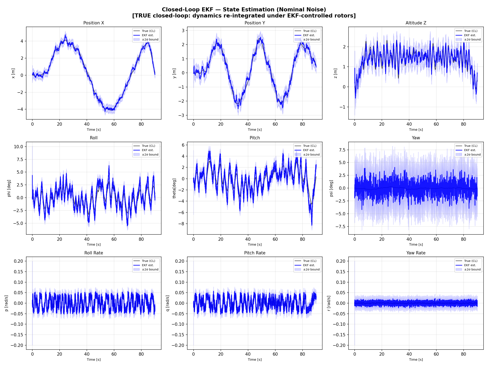

# Closed-Loop GNC: Cascade PID + 12-State EKF for a Nonlinear Quadcopter


**A true closed-loop GNC simulation: the flight controller never sees the true state. It flies entirely on the estimates of a 12-state Extended Kalman Filter fusing GPS (10 Hz), gyro and accelerometer (200 Hz), and magnetometer (50 Hz). Achieves 0.30 m 3D position RMSE with consumer-grade 0.5 m GPS, verified statistically consistent (NEES 12.59 vs ideal 12.0), and maintains stable flight under 5x GPS-noise degradation. Seeded and reproducible.**



---

## Why "closed-loop" matters

Most student EKF projects run the filter open-loop: the vehicle is flown on ground truth and the EKF is graded offline. Here the loop is actually closed. The cascade PID reads only the EKF estimate, so estimation errors feed back into control, control errors excite the dynamics the filter must track, and any filter divergence crashes the vehicle. This is the configuration that matters on real aircraft, and it is substantially harder to make work.

The experiment runs in phases: (1) baseline PID on true state to generate the reference mission and rotor history, (2) the identical mission flown closed-loop on EKF estimates, (3) a stress test with 5x GPS noise, still closed-loop.

---

## Highlights

- **12-state EKF**: position, velocity, Euler angles, body rates; analytical 12x12 process Jacobian; 2nd-order discretization of F; Joseph-form covariance update for numerical stability
- **Nonlinear accelerometer update**: roll/pitch observed through gravity projection (h(x) = [g sin(theta), -g sin(phi) cos(theta)]), with a state-dependent H recomputed every call, the only nonlinear measurement in the filter
- **Chi-squared innovation gating (NIS)**: per-sensor Mahalanobis gates reject outliers (GPS multipath, spikes) before they corrupt the state
- **Dual adaptation**: GPS R inflated online from a 2 s innovation window (Mehra 1970), and velocity process noise Q scaled with commanded acceleration during turns
- **Statistical consistency, not just low RMSE**: NEES computed against the true closed-loop state over the whole mission, 12.59 against an ideal of 12.0 for a 12-state filter
- **Realistic sensor simulation**: the simulated accelerometer measures true specific force (gravity projection plus inertial acceleration), while the filter's measurement model deliberately uses only the gravity term, so the model mismatch a real IMU would produce is present and absorbed by R
- **Multi-rate fusion**: 200 Hz predict/IMU, 50 Hz magnetometer, 10 Hz GPS, all against a full nonlinear plant

---

## Results

Mission: 8 m x 4 m figure-8 (omega = 0.1 rad/s, period about 63 s) at 1.5 m altitude, 90 s flight with takeoff and landing phases, metrics over the t = 8-82 s figure-8 phase. Controller closed on EKF estimates throughout. Noise draws are seeded (seed 42), so these numbers regenerate exactly.

### Per-state estimation RMSE

| State | Nominal | Stress (GPS x5) |
|-------|---------|-----------------|
| x | 0.1695 m | 0.8917 m |
| y | 0.1608 m | 0.6426 m |
| z | 0.1813 m | 0.8063 m |
| vx | 0.1279 m/s | 0.3261 m/s |
| vy | 0.1292 m/s | 0.2896 m/s |
| vz | 0.1340 m/s | 0.2801 m/s |
| phi roll | 0.0162 rad (0.93 deg) | 0.0260 rad (1.49 deg) |
| theta pitch | 0.0149 rad (0.85 deg) | 0.0313 rad (1.79 deg) |
| psi yaw | 0.0211 rad (1.21 deg) | 0.0211 rad |
| p, q, r | about 0.0056 rad/s | about 0.0056 rad/s |

**3D position RMSE: 0.30 m nominal** with a 0.5 m sigma consumer-GPS sensor at only 10 Hz. The filter beats its own position sensor. Roll and pitch estimation stay below 1 degree.

Note the observability structure under stress: yaw and the body rates are identical between nominal and 5x GPS noise. GPS does not observe those states (yaw comes from the magnetometer, rates from the gyro), so degradation stays confined to the GPS-observable subspace, exactly as theory predicts. This is a direct check that the measurement models are wired correctly.

### Filter consistency (NEES)

Normalized Estimation Error Squared against the true closed-loop state, mean over the figure-8 phase; ideal is 12.0 for a 12-state filter:

| Scenario | NEES | Interpretation |
|----------|------|----------------|
| Nominal | **12.59** | Statistically consistent: the covariance honestly reflects the true error |
| Stress (GPS x5) | 46.08 | Filter optimistic under unmodeled 5x noise inflation, but bounded: navigation and closed-loop flight maintained |

Low RMSE alone can hide an overconfident filter; NEES is the standard test that the filter knows how wrong it is. Most reported EKFs skip it.

---

## Sensor Suite

| Sensor | Rate | Noise (1 sigma) | Observes | NIS gate (chi-squared) |
|--------|------|------------|----------|---------------|
| GPS position | 10 Hz | 0.50 m | x, y, z | 16.27 (3-DOF, 99.9th percentile; deliberately loose so adaptive R, not the gate, handles sustained degradation) |
| Gyroscope | 200 Hz | 0.01 rad/s | p, q, r | 7.81 (3-DOF, 95th percentile) |
| Accelerometer | 200 Hz | 0.05 m/s^2 | phi, theta via gravity projection | 5.99 (2-DOF, 95th percentile) |
| Magnetometer | 50 Hz | 0.05 rad | psi | 3.84 (1-DOF, 95th percentile) |

---

## Architecture

```
                       +----------------------------------+
 reference (fig-8) --> |  CASCADE PID                     |
                       |  position 50 Hz -> attitude      |--> torques, thrust
                       |  100 Hz -> rate 200 Hz           |        |
                       |  (anti-windup, vel feedforward)  |        v
                       +------------^---------------------+   +-------------+
                                    |  x_hat (never x_true)   |  ALLOCATOR +|
                                    |                         |  12-STATE   |
                       +------------+---------------------+   |  NONLINEAR  |
                       |  12-STATE EKF (200 Hz predict)   |   |  PLANT      |
                       |  - analytical F, 2nd-order disc. |   +------+------+
                       |  - Joseph-form update            |          | true state
                       |  - NIS gating per sensor         |   +------v------+
                       |  - adaptive R_gps + adaptive Q_v |<--|  SENSOR SIM |
                       +----------------------------------+   |  GPS/IMU/MAG|
                                                              +-------------+
```

---

## Quick Start

```bash
pip install numpy scipy matplotlib c4dynamics
python quad_ekf_run.py
```

Runtime is several minutes (three 18,000-step closed-loop simulations with a variable-step integrator). All figures save to `results/`.

| Figure | Description |
|--------|-------------|
| `fig1_ekf_state_estimation.png` | True vs estimated states with 2-sigma bounds, nominal run |
| `fig2_stress_test.png` | Closed-loop flight under 5x GPS noise |
| `fig3_nees.png` | NEES consistency over time |
| `fig4_innovations.png` | Innovation sequences per sensor |
| `fig5_covariance.png` | 1-sigma position uncertainty evolution |

## Repository Structure

```
+-- quad_ekf.py          # EKF (predict/update, Jacobian, gating, adaptation) + sensor simulator
+-- quad_ekf_run.py      # closed-loop runner, phases, metrics, plots
+-- quad_pid_utils.py    # nonlinear plant, cascade PID, 3-phase figure-8 trajectory
+-- results/             # generated figures
```

---

## Technical Notes

### Prediction

State propagated by Euler integration of the full nonlinear dynamics; covariance propagated with a **2nd-order discretization** of the analytical Jacobian, F_d = I + dt F + (dt^2/2) F^2, which is markedly more accurate than I + dt F at 5 ms with the fast rate dynamics. Yaw is wrapped to [-pi, pi] after every integration step. Without this, psi drifts unboundedly until magnetometer innovations exceed the gate and yaw corrections silently stop. (Found the hard way; documented in the code.)

### Accelerometer as an attitude sensor

Without the accelerometer, roll and pitch are only weakly observable through the attitude-acceleration coupling in 10 Hz GPS, a signal buried in noise. The accelerometer observes the gravity direction directly at 200 Hz:

```
h(x) = [ g sin(theta), -g sin(phi) cos(theta) ]
```

with H recomputed at every update from the current estimate. **Stated model limitation:** a real accelerometer measures specific force, and during the figure-8 the vehicle's own horizontal acceleration exceeds the gravity-tilt signal at small angles. The sensor simulator models the full specific force (gravity projection plus finite-differenced inertial acceleration), while the filter's measurement model deliberately uses only the gravity projection; R_acc absorbs the mismatch. The NEES results confirm the approximation is honest at this flight envelope.

### Innovation gating (NIS)

Every update computes the normalized innovation squared, NIS = y' S^-1 y, and rejects the measurement if it exceeds a chi-squared threshold for the sensor's degrees of freedom (table above). The GPS gate is intentionally set at the 99.9th percentile rather than the 95th: under sustained degradation, adaptive R should down-weight GPS smoothly rather than the gate rejecting it outright and leaving position dead-reckoned.

### Adaptive noise

**Adaptive R (GPS):** the R scale is estimated from a 2 s sliding window of innovations (Mehra 1970). The implementation is deliberately **two-phase**: the scale computed from this update's innovation is applied at the start of the next GPS update, so the S used for gating and the S used for the Kalman gain are always computed from the same R. (An earlier single-phase version updated R mid-step, making the gate test inconsistent with the applied update.)

**Adaptive Q (velocity):** velocity process noise is scaled up to 2x when commanded acceleration exceeds 0.4 m/s^2, opening the covariance during turns instead of letting the filter over-trust its prediction.

### Joseph-form update

P = (I - KH) P (I - KH)' + K R K', guaranteed symmetric positive semi-definite regardless of round-off, unlike the short form (I - KH) P.

### Magnetometer with circular statistics

The yaw innovation is computed with atan2 wrapping and fed directly into the gain equations, so the raw measurement never touches the state vector and the wrap-around at +/-180 degrees introduces no correlation bias.

---

## Extensions and Future Work

- **GPS-denied coasting**: quantify drift growth during GPS outages and add outage scenarios to the stress suite
- **RTK-grade measurement model**: swap the 0.5 m GPS for 1-2 cm RTK noise and re-tune, matching precision-navigation applications
- **Magnetometer disturbance rejection**: inject hard-iron steps and let NIS gating plus a mag-health monitor handle them
- **Error-state (multiplicative) quaternion EKF**: remove Euler singularities for aggressive attitude envelopes
- **Replay on real flight logs**: run the filter on PX4 ULog IMU/GPS data as a stepping stone from simulation to hardware

---

## References

1. Bar-Shalom, Li, Kirubarajan, *Estimation with Applications to Tracking and Navigation*, Wiley, 2001 (NEES/NIS consistency testing)
2. Mehra, "On the identification of variances and adaptive Kalman filtering", *IEEE Transactions on Automatic Control*, 1970
3. Luukkonen, *Modelling and Control of Quadcopter*, Aalto University, 2011 (vehicle model and parameters)

---

## License

MIT license; see [LICENSE](LICENSE).
