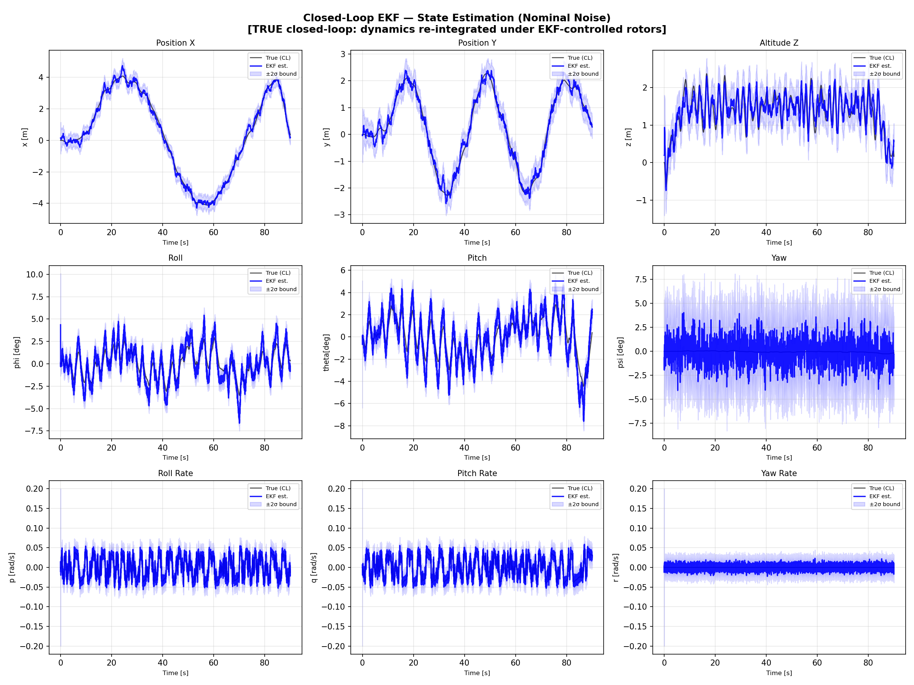
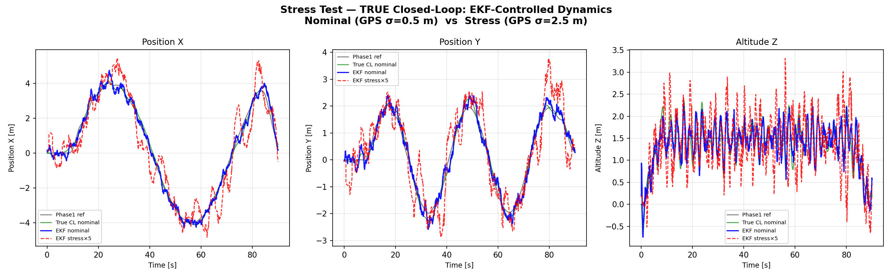
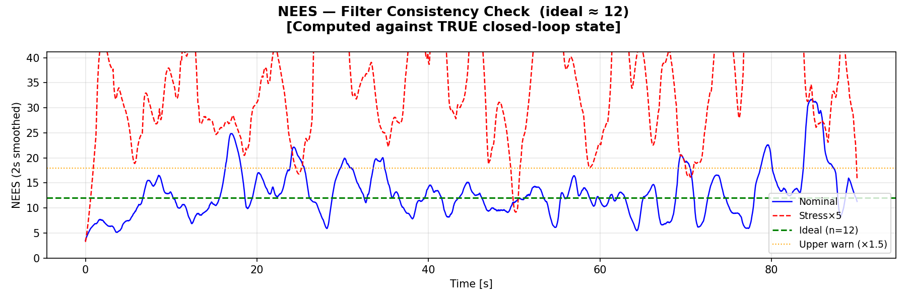
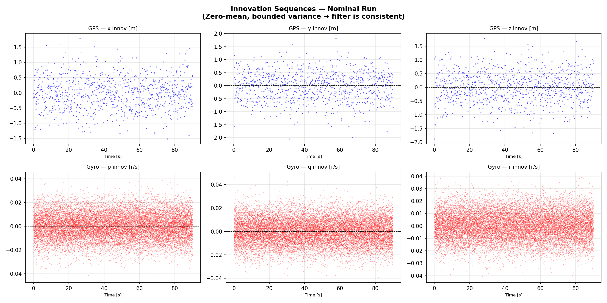
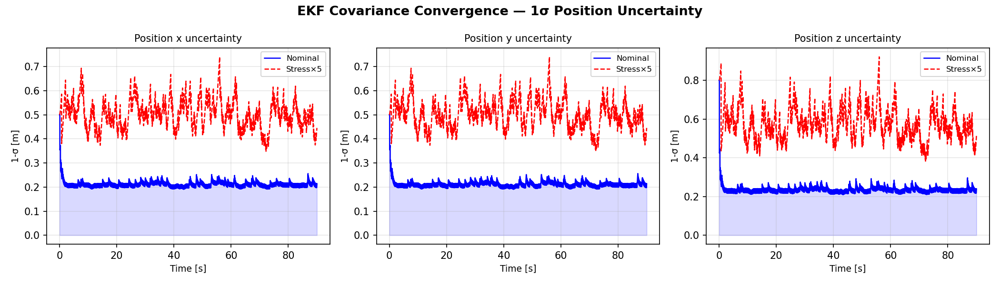

# quadcopter-cascade-PID-EKF-closed-loop-GNC-simulation
A closed-loop Guidance, Navigation, and Control (GNC) simulation of a nonlinear quadcopter with cascade PID control and EKF-based state estimation.

---

## What This Demonstrates
- **Cascade PID**: outer position (50 Hz) → attitude (100 Hz) → rate (200 Hz)
- **12-state EKF**: analytical Jacobian, Joseph-form covariance, innovation gating
- **Closed-loop**: controller feeds off EKF estimates, not true state
- **NEES validation**: nominal NEES = 12.72 vs ideal = 12.0
- **Sensor fusion**: GPS (10 Hz) · Gyro (200 Hz) · Magnetometer (50 Hz) · Accelerometer (200 Hz)
- **Stress test**: adaptive GPS R handles 5× noise degradation gracefully

---

## Results

| State | Nominal | Stress (GPS×5) |
|-------|---------|----------------|
| x | 0.187 m | 0.985 m |
| y | 0.161 m | 0.709 m |
| z | 0.191 m | 1.213 m |
| vx | 0.137 m/s | 0.260 m/s |
| vy | 0.126 m/s | 0.229 m/s |
| vz | 0.136 m/s | 0.235 m/s |
| φ (roll) | 0.0157 rad | 0.0227 rad |
| θ (pitch) | 0.0153 rad | 0.0272 rad |
| ψ (yaw) | 0.0211 rad | 0.0211 rad |
| p | 0.0056 rad/s | 0.0056 rad/s |
| q | 0.0055 rad/s | 0.0055 rad/s |
| r | 0.0057 rad/s | 0.0057 rad/s |

**NEES** (mean over figure-8 phase, ideal ≈ 12.0 for a 12-state filter):
- Nominal: **12.72** - statistically consistent
- Stress (GPS×5): **37.76** - filter stressed but navigation maintained
  
---

## Visualizations











---

## Files
- `quad_pid_utils.py` — dynamics, cascade PID, trajectory
- `quad_ekf.py` — EKF, Jacobian, sensor simulator
- `quad_ekf_run.py` — closed-loop simulation runner

---

## Dependencies
```bash
pip install numpy scipy matplotlib c4dynamics
```
